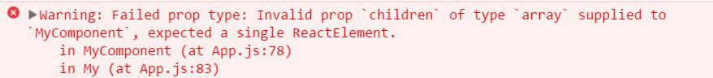

## 用`PropTypes`检测类型

> 注意：`React v15.5.`已经把`React.PropTypes`分离了，请用`prop-types`库替代

```
npm install --save prop-types
```
项目做大了后经常就会出现类型错误的`bug`，平时可以用`JS插件`如`Flow`,`TypeScript`检测。如果不用这些插件的话，`React`也提供了检测工具,给某个组件检测`props`类型时，可以给他扩展一个`propTypes`属性：
```js
import PropTypes from 'prop-types';

class Greeting extends React.Component {
  render() {
    return (
      <h1>Hello, {this.props.name}</h1>
    );
  }
}
// name只能是字符串
Greeting.propTypes = {
  name: PropTypes.string
};

```
如果类型不是字符串的时候就会报错，**这种检测只在生产环境中使用**

### PropTypes
以下是默认类型
```js
import PropTypes from 'prop-types';

MyComponent.propTypes = {
  // You can declare that a prop is a specific JS primitive. By default, these
  // are all optional.
  optionalArray: PropTypes.array,
  optionalBool: PropTypes.bool,
  optionalFunc: PropTypes.func,
  optionalNumber: PropTypes.number,
  optionalObject: PropTypes.object,
  optionalString: PropTypes.string,
  optionalSymbol: PropTypes.symbol,

  // Anything that can be rendered: numbers, strings, elements or an array
  // (or fragment) containing these types.
  optionalNode: PropTypes.node,

  // A React element.
  optionalElement: PropTypes.element,

  // You can also declare that a prop is an instance of a class. This uses
  // JS's instanceof operator.
  optionalMessage: PropTypes.instanceOf(Message),

  // You can ensure that your prop is limited to specific values by treating
  // it as an enum.
  optionalEnum: PropTypes.oneOf(['News', 'Photos']),

  // An object that could be one of many types
  optionalUnion: PropTypes.oneOfType([
    PropTypes.string,
    PropTypes.number,
    PropTypes.instanceOf(Message)
  ]),

  // An array of a certain type
  optionalArrayOf: PropTypes.arrayOf(PropTypes.number),

  // An object with property values of a certain type
  optionalObjectOf: PropTypes.objectOf(PropTypes.number),

  // An object taking on a particular shape
  optionalObjectWithShape: PropTypes.shape({
    color: PropTypes.string,
    fontSize: PropTypes.number
  }),

  // 每个类型后面跟 `isRequired` 表示props一定要有这个类型，否则报错
  requiredFunc: PropTypes.func.isRequired,

  // A value of any data type
  requiredAny: PropTypes.any.isRequired,

  // You can also specify a custom validator. It should return an Error
  // object if the validation fails. Don't `console.warn` or throw, as this
  // won't work inside `oneOfType`.
  customProp: function(props, propName, componentName) {
    if (!/matchme/.test(props[propName])) {
      return new Error(
        'Invalid prop `' + propName + '` supplied to' +
        ' `' + componentName + '`. Validation failed.'
      );
    }
  },

  // You can also supply a custom validator to `arrayOf` and `objectOf`.
  // It should return an Error object if the validation fails. The validator
  // will be called for each key in the array or object. The first two
  // arguments of the validator are the array or object itself, and the
  // current item's key.
  customArrayProp: PropTypes.arrayOf(function(propValue, key, componentName, location, propFullName) {
    if (!/matchme/.test(propValue[key])) {
      return new Error(
        'Invalid prop `' + propFullName + '` supplied to' +
        ' `' + componentName + '`. Validation failed.'
      );
    }
  })
};
```
### 限制一个`child`

传入的`props。children`只能包含`一个兄弟元素(独生子)`，否则报错。可以有`子元素`
```js
import PropTypes from 'prop-types';

class MyComponent extends React.Component {
  render() {
    // 必须是一个元素否则报错
    const children = this.props.children;
    return (
      <div>
        {children}
      </div>
    );
  }
}

MyComponent.propTypes = {
  children: PropTypes.element.isRequired
};
```

